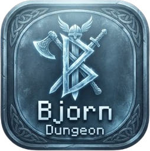

<p align="center">
  
</p>

# Bjorn Dungeon

[](LICENSE)  [](https://github.com/infinition/bjorn_dungeon/releases) [](https://buymeacoffee.com/infinition)

A browser-based dungeon crawler built around the Bjorn Cyberviking universe. Runs entirely in the browser with no install required.

Live: https://infinition.github.io/bjorn_dungeon/

---

## Features

- **Room-based dungeon generation**: rooms + corridors, doors, hidden **secret passages**, treasure rooms, a boss room and a **portal that descends to the next floor - infinite depth** with scaling difficulty
- **Biomes** (crypt / ice / forge / void / swamp) selected per floor: they tint walls & floor, change fog/ambient/light colour, bias the monster pool and pick a matching boss
- **Multiple bosses** (Guardian, Frost Queen, Infernal Smith…), chosen by biome
- **Atmospheric rendering**: warm wall torches with flicker, glowing wall runes, spinning portal, colour grading (contrast/saturation) + vignette
- **Loot & farming**: 4 rarities (vert / bleu / jaune / violet) with **random affixes that scale hugely with rarity** - rarer = far stronger, built to farm
- **14 equipment slots**: helmet, cape, necklace, chest, gloves, 2 rings, belt, legs, boots, melee main hand, off hand, **dedicated ranged slot** (bow/crossbow) and **dedicated magic slot** (staff/scepter) - so a sword-and-shield warrior can keep them equipped and instantly switch to a crossbow or to spells
- **Unified action bar**: melee weapon, ranged weapon and spells are all switchable actions (wheel / 1-N); the viewmodel swaps per action (sword+shield / crossbow / staff while casting)
- **Weapon classes**: sword, axe, dagger, greatsword (2H), staff (caster), bow, crossbow - each drives a different primary attack (melee swing / arrow / spell)
- **Defense skills**: auto-**block** and auto-**parry** scaled by allocated attribute points (and boosted by a shield), plus active blocking on right-click
- **Stealth** (furtivité) reduces enemy detection range
- **Attributes**: +3 points per level into Force / Dextérité / Intelligence / Vitalité / Blocage / Parade / Furtivité
- 5 spells incl. **heal**; mana, cooldowns, distinct VFX
- **Animations**: first-person weapon viewmodel (swing / shoot / cast / drink / guard), spinning portal, chest opening, enemy walk/attack/death, particles & floating damage numbers
- Enemies with behaviors (chaser / phaser / caster), boss with enrage + seismic slam + summons
- XP / leveling, gold, honor, kills, floor depth; Game Over screen
- Keyboard + mouse, touch and gamepad support
- **Bjorn Forge** (`forge.html`) - full in-browser authoring studio:
  - Edit items, monsters, spells, boss, objects, rarities and environment with typed fields (stats, loot tables, color pickers)
  - Import sprites as single image or spritesheet; multi-state animations (idle / walk / attack / death) with live animated preview
  - Built-in image editor: crop, resize with ratio lock, pixel-snap, chroma-key background removal, trim transparent borders
  - Sprites embedded as base64; project saved to localStorage, importable/exportable as JSON or `data.js`
  - "Play" button launches the game with the authored content
- Legacy simple editor (`editor.html`) still available

## Controls

| Action | Input |
| --- | --- |
| Move / aim | ZQSD + mouse (or arrows) |
| Primary attack (weapon-based) | Click / Space |
| Cast selected spell | C |
| Block / parry (hold) | Right-click / Left Shift |
| Switch spell | Mouse wheel or keys 1-4 |
| Open chest / reveal secret | E |
| Inventory & character sheet | I |
| Quick heal potion | F |
| Toggle sound | M |

In the inventory: click a bag item to equip/use, click an equipped slot to unequip, right-click a bag item to drop, and spend attribute points with the **+** buttons.

---

## Running locally

For the best experience, including **server-side save** (in addition to `localStorage`), run the bundled Node server which stores saves under `saves/`.

**Windows:**
Double-click the `lancer.bat` file. It will automatically start the Node server and open the game in your browser.

**Linux / macOS / Windows (Command line):**
Ensure you have Node.js installed, then run:

```bash
node server.js
```
Then open `http://localhost:8100` in your browser.

Alternatively, you can simply open `index.html` directly in any modern browser, or serve the folder without the save server using Python:

```bash
# Windows
python -m http.server 8080

# Linux / macOS
python3 -m http.server 8080
```

Saves persist in `localStorage` either way; the Node server adds a per-character copy on disk. Create a character by name (the name deterministically grants a class bonus), pick **Delve** (descend, boss per floor) or **Labyrinth** (endless maze, free portal), and on death you respawn at the last floor checkpoint.

---

## Stack

- Vanilla JS, no framework, no build step
- Tailwind CSS (CDN)
- Press Start 2P pixel font

---

## Star History

<a href="https://www.star-history.com/?repos=infinition%2Fbjorn_dungeon&type=date&legend=top-left">
 <picture>
   <source media="(prefers-color-scheme: dark)" srcset="https://api.star-history.com/chart?repos=infinition/bjorn_dungeon&type=date&theme=dark&legend=top-left" />
   <source media="(prefers-color-scheme: light)" srcset="https://api.star-history.com/chart?repos=infinition/bjorn_dungeon&type=date&legend=top-left" />
   
 </picture>
</a>

---

## License

MIT. See [LICENSE](LICENSE).
